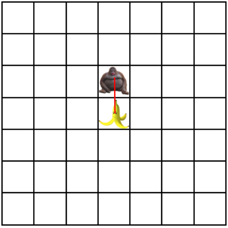
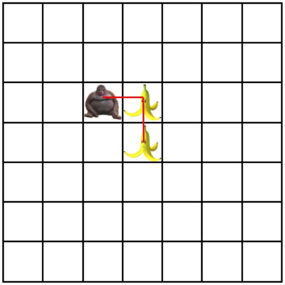
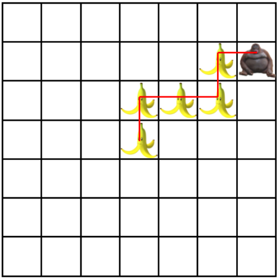
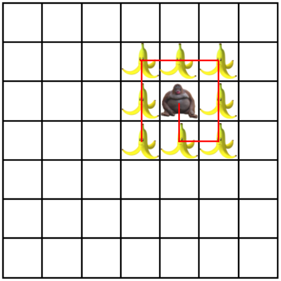

# Escape Simulator

## Problem Description

Shenanigans are afoot at the Atlanta Zoo! A new shipment of bananas is being brought in to supply food to all of the primate exhibits. Since the zookeepers are asleep, Madu the orangutan is making an attempt to escape from her habitat and hijack the operation so she can hoard them all for her fellow orangutans. This is a morally questionable thing for Madu to do, so it is our job as habitat designers to make the likelihood of her success as low as possible.

Our goal for this problem is to design a simulation that can model Madu's escape attempt and determine whether or not she succeeds. From there, we can calculate the probability of her success in a given environment.

## Rules of the Simulation

1. Madu's habitat is rectangular and can be represented by a two-dimensional grid. At the start of any test run, Madu should start at the center of the grid. 

    

1. Madu's spatial intelligence is very low, so she aimlessly wanders the habitat in an attempt to escape. Additionally, she makes a mess as she mills about, dropping banana peels all over the place. To model this, we can break down her walking pattern into a series of moves. On a single move, Madu will do the following:

    1. Change her position by one square. She is allowed to move up, down, left, or right.
    2. Drop a banana peel in the spot she was in on her last turn.

    Madu will opt to move in a random direction each turn, but if there is a banana peel in her path, she'll try to avoid it.

    Example:

    

    On this turn, Madu starts at the center of the grid. There are no banana peels in her path, so she is allowed to move up, down, left, or right. In this particular case, she    happened to move up a square. A banana peel was placed in her original spot.

    Here's the next turn she takes:

    

    On this turn, the conditions are different. Madu can still move up, left, or right, but there is now a banana peel in the space below her. This prevents her from moving downwards. However, since she can still move in other directions, she randomly opts to move to the left. 
    
    
1. In order to successfully escape her habitat, Madu must reach the edge of the grid. As responsible habitat designers, we have created hers such that there are no walls or obstructions between her and the outside world, so reaching the edge of the grid would constitute a successful escape attempt. Here's an example of what that may look like:

    

    In order for her to fail, all of Madu's movement options must be eliminated by her own doing. If Madu is surrounded on all sides by banana peels, she won't be able to move to any of those spaces. Here's an example of what that may look like:
    
    
    
    
## Functional Requirements

In this project, we'll be making two classes, `Simulation.java` and `Driver.java`. 

`Simulation.java` should contain four public methods:

1.  `Simulation(int numRows, int numCols)`: A constructor for the simulation grid. `numRows` denotes the number of rows in your grid, and `numCols` denotes the number of columns. When called, it creates a new instance of the `Simulation` class containing a grid based on these requirements.
2.  `void reset()`: This instance method should clear any banana peels from your grid and move Madu back to the center.
3.  `boolean run()`: This instance method should run a single trial of the simulation, returning `true` if Madu escapes and `false` if she fails.
4.  `String toString()`: This instance method should return a `String` representation of the current instance. 

`Driver.java` should contain two public methods:

1. `static double calculateProbability(Simulation s, int trials)`: This static method should calculate the probability that a given `Simulation` succeeds over a certain amount of trials.
2. `static void main(String[] args)`: The main method.

