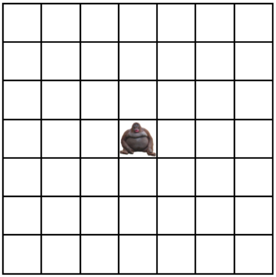

# Escape Simulator

## Problem Description
Shenanigans are afoot at the Atlanta zoo! A new shipment of bananas is being brought in to supply food to all of the primate exhibits. Since the zookeepers are asleep, Madu the orangutan is making an attempt to escape from her habitat and hijack the operation so she can hoard them all for her fellow orangutans. This is a morally questionable thing for Madu to do, so it is our job as habitat designers to make the likelihood of her success as low as possible.

